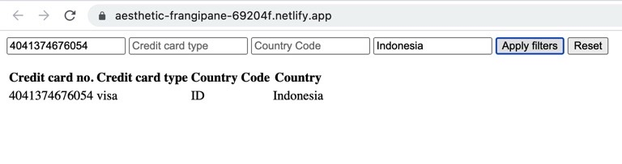

- Project consists of the following parts:
    1. Data - Designed and created json data file using mockaroo.com
    - With 200 items of card data
    - Each item with 4 different fields - Card No, Card Type, Country Code, Country
    - data folder contains the card.json file
    2. API - Created controller-cards.js with getAll and gettById functions. It is inside api folder.
    3. View
    - Inside dist folder created index.html
    - index.html contains the table header, empty table body, filter inputs, submit & reset buttons
    - the script has the src- ./bundle.js
    4. Table
    - empty html table that would has column for each field of the json data
    - Dynamically loaded data from card.js into this table
    5. Filter Form
    - Submit and Reset buttons can be used to submit & reset the filters respectively
    - Created input field in the screen for each field in the json file
    6.  Deployment - 
    - Ran the command npm init
    - Installed browserify as dev dependency with command - npm install --save-dev          browserify 
    - Added script-  "build": "browserify main.js -o dist/bundle.js" in package.json
    - Ran build command - npm run build
    - Committed to git
    - Deployed the project to netlify
    - Set the build path - /project-2/dist

- Ouput without filter

- Output with filter

