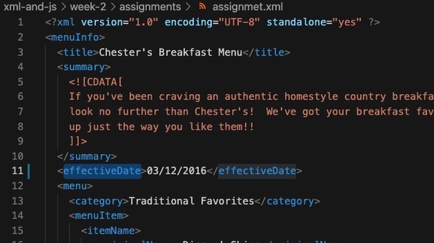
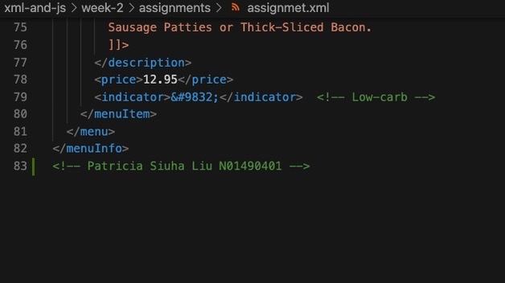
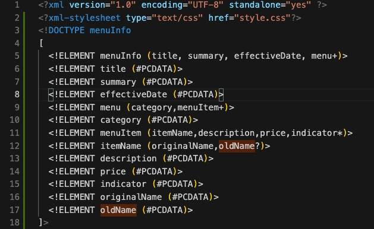
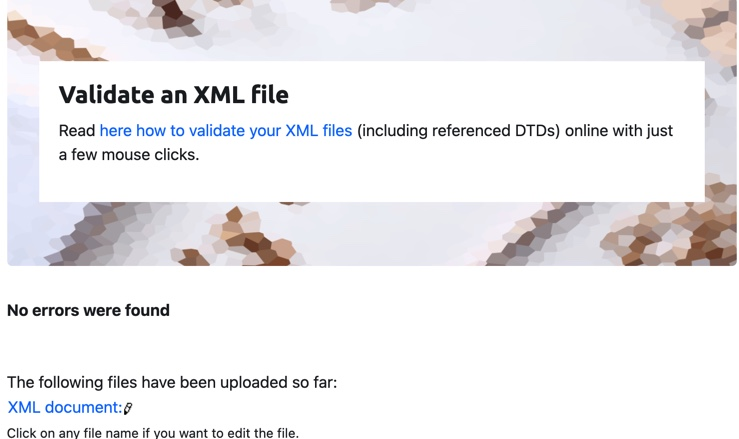
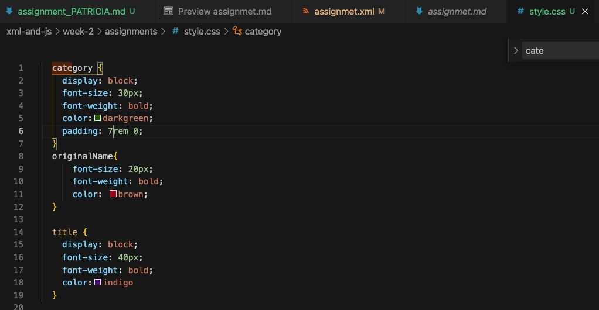
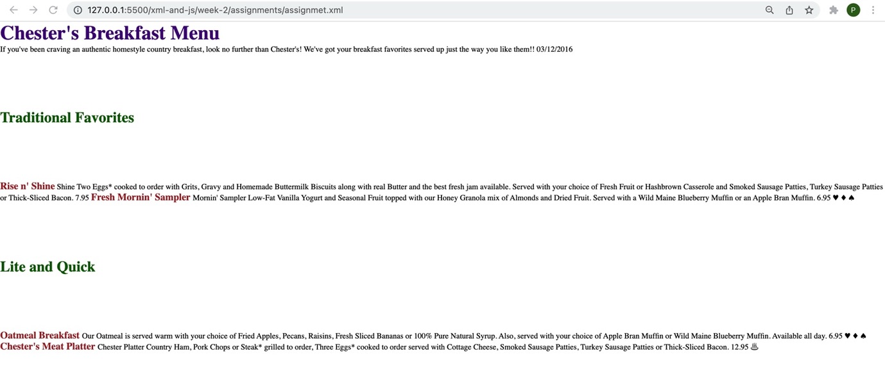

# Assignment 1 - Week 2

1. Error:- Element name "effective Date" has a blank space between. Element names cannot have blank spcaes. Fix:- Element changed to "effectiveDate" in `week-2/assignments/assignment.xml`

2. Special characters like !, ', * can be added into xml document by character or entity references. If we do not want to use the character or entity references and instead want to use the special characters as it is, we can use CDATA. Character data is not processed, but instead is treated as pure data content.

3. Comment added to `week-2/assignments/assignment.xml`

4.  prolog-

    

    document body- MenuInfo

    

    epilog-

    

    processing instructions- Not available

5. DTD added to `week-2/assignments/assignment.xml`

    

6. DTD validation

     

7. CSS added

    Output
