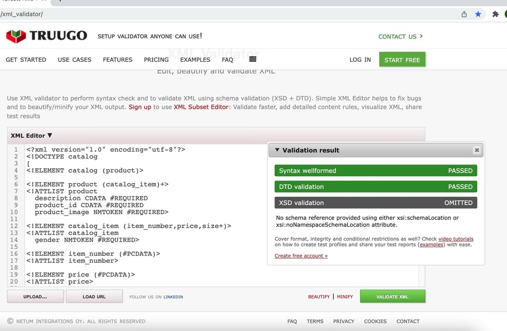
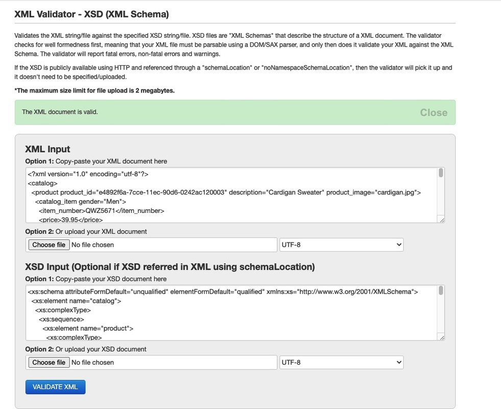

# Assignment 2 - Week 3

Q2. 

Q3.

Q4.  
    DTD - 
    
    1. <!ELEMENT catalog (product)>

    The Element catalog contains child product

    2. <!ELEMENT product (catalog_item)+>

    Product contains element catalog_item , and it occurs min once

    3. <!ATTLIST product
    description CDATA #REQUIRED
    product_id CDATA #REQUIRED
    product_image NMTOKEN #REQUIRED>

    Product has 3 attributes ‘description' of type CDATA, ‘product_id’ of type CDATA and product_image of type nmtoken, and all required to be present 
    4. Element catalog_item contains item_number, price and size (size occurs at least once). It has attribute gender of type NMTOKEN
    item_number contains parse character data (PCDATA) and has attribute item_number
    5. Price contains parse character data (PCDATA) and has attribute price
    6. Size contains element color_swatch and has required CDATA attributes size & description
    7. color_swatch contains parse character data and has attribute image of type NMTOKEN and is a required attribute

    XSD-

    1.  

    The Element catalog contains child product.
    catalog contains a sequence of elemtent product which is a complex type
    <xs:element name="product">

    2. Product contains element catalog_item , and it occurs min once

    <xs:element name="catalog_item" maxOccurs="unbounded" minOccurs="1">>

    3. Product has 3 attributes ‘description' of type string, ‘product_id’ of type string and product_image of type string, and all required to be present 
    4. Element catalog_item contains item_number(string), price (float)and size (size occurs at least once). 