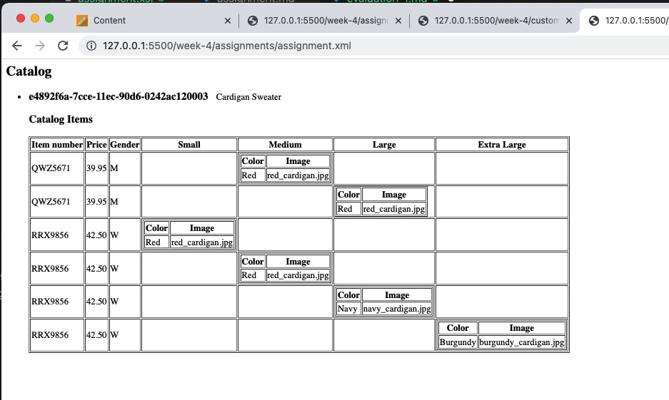
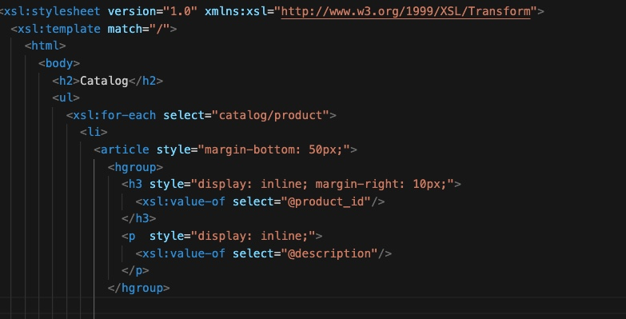
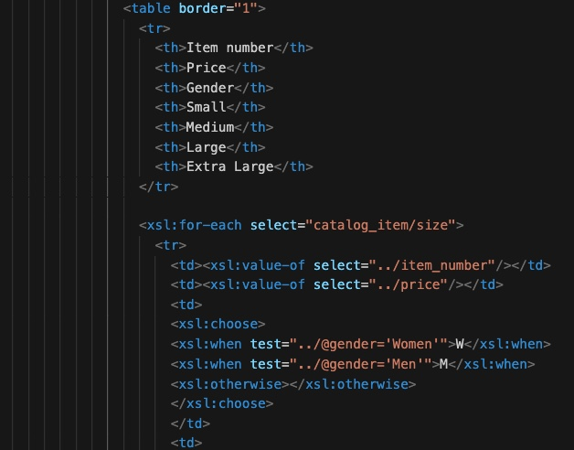
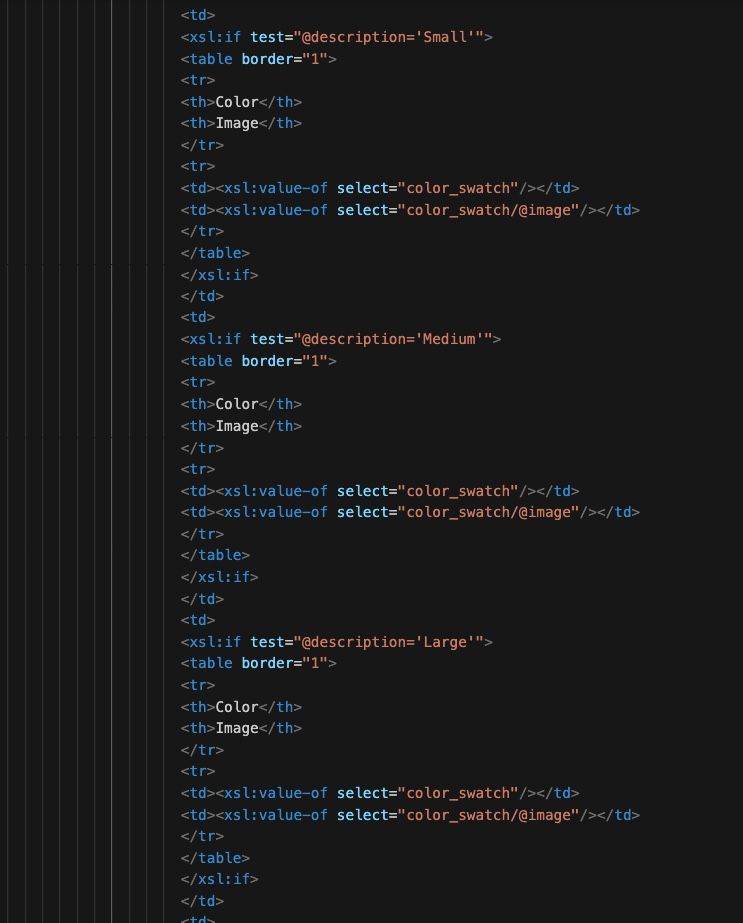

# Assignment - Week 4

Output

## Screnshots for the for following steps

- main title is "Catalog"
- use html list tag to display catalog
- render each item as `<article>` inside list item tag
- display product id as h3
- display product description as paragraph

- render table of cataaalog items with columns: item number, price, gender, small, medium, large, extra large (if column item is not present in item, then display empty cell)
- for gender column render M for Men, W for Women

- inside size columns (small, medium, large, and extra large) display subtable with 2 columns: color and image

## Thought Process - 

    1. To get all the sizes as a row in the mian table, looped through  catalog/product/catalog_item/size
    like:-
     <xsl:for-each select="catalog_item/size"> 

    2. For each row the item number, price and gender is selected from the parent element of catalog/product/catalog_item/size which is element - catalog/product/catalog_item
    like:- 
     <td><xsl:value-of select="../item_number"/></td>
     <td><xsl:value-of select="../price"/></td>

    3.Used xsl:choose tag to convert Women to W and Men to M
    like:-
      <xsl:choose>
                      <xsl:when test="../@gender='Women'">W</xsl:when>
                      <xsl:when test="../@gender='Men'">M</xsl:when>
                      <xsl:otherwise></xsl:otherwise>
      </xsl:choose>

    4.Under each size column -  Small, Medium, Large , X-Large checkd if the attribute @description was same as the size in the column name
    eg . <xsl:if test="@description='Medium'">

    5.Based on the check in step 4, if true - created a sub table under each size column -  Small, Medium, Large , X-Large and added color and image and bound it to the color_swatch & color_swatch's attribute image respectively
    like:- 
    <td><xsl:value-of select="color_swatch"/></td>
    <td><xsl:value-of select="color_swatch/@image"/></td>
    

    